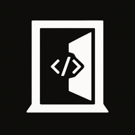
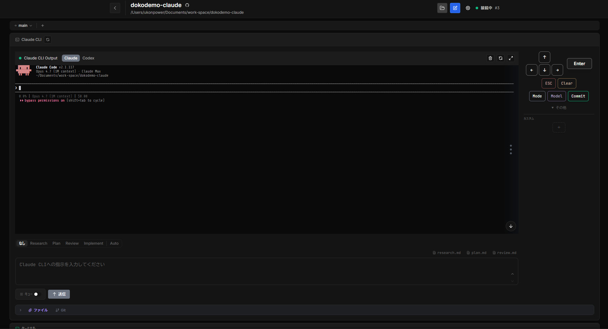

<p align="center">
  
</p>

# dokodemo-claude

Claude Code / Codex などの AI CLI を Web ブラウザから操作するための、個人利用向けの最小限のインターフェース。

スマホからでもどこからでも（dokodemo）、自宅 PC 上の Claude Code を使った作業を継続できることを想定したツール。



## 主な機能

- Git リポジトリの登録・切り替え・worktree 管理
- Claude Code / Codex CLI のブラウザ上での対話（xterm.js）
- node-pty によるインタラクティブターミナル（複数タブ対応）
- Prompt Queue（`/clear` や `/commit` のプレフィックス付与、自走キュー）
- Git ブランチ切替・diff 表示・ファイルビューア
- Web Push 通知（Safari / Apple 対応）

## 必要環境

| 依存 | 備考 |
|------|------|
| Node.js 22 以上 | `volta.node: 22.17.0` を参考 |
| [Claude Code CLI](https://docs.anthropic.com/claude-code) または [Codex CLI](https://github.com/openai/codex) | |
| Git | |
| node-pty 用ビルドツール | macOS: Xcode Command Line Tools / Linux: build-essential |
| `jq` | Claude Code hooks 用。`npm run setup` で自動インストール試行あり |

## クイックスタート

### 1. Clone & Setup

```bash
git clone <このリポジトリ>
cd dokodemo-claude
npm run setup   # 依存 install + .env 生成 + jq チェック
```

### 2. 起動

常時稼働運用を前提とした `npm run start` での起動を推奨します。

```bash
npm run start
```

| エンドポイント | デフォルト |
|----------------|-----------|
| Web UI + API | https://localhost:8001 |

`npm run start` の挙動：

- `apps/dokodemo-claude-web/dist/index.html` が無ければ初回のみワンショットビルドを実行
- `tsx watch` で API をソース直接実行（ファイル変更で自動再起動）
- `vite build --watch` で `dist` を継続再生成
- Express が同一プロセス・同一ポート（`DC_API_PORT`）で API と Web を配信

Web UI 上の「更新」ボタンを押すと `git pull` のみ実行され、`tsx watch` / `vite build --watch` / PWA Service Worker (autoUpdate) が新しいソースを自動で吸収します。手動リロードは不要です（PWA の更新検知後に切り替わるまでに数十秒かかります）。

ポートは `.env` の `DC_API_PORT` で変更できます。

> 開発者向けの HMR ありの起動方法は [開発者向け](#開発者向け) を参照してください。

### 3. HTTPS 設定（任意・推奨）

モバイルから Service Worker / Web Push を利用するには HTTPS が必要です。
[mkcert](https://github.com/FiloSottile/mkcert) 等で証明書を生成し、`.env` に指定してください。

```bash
mkcert -install
mkcert -cert-file /path/to/server.crt -key-file /path/to/server.key localhost
```

`DC_USE_HTTPS=false` にすれば HTTP でも起動できます。

## 設定リファレンス（`.env`）

| 変数 | デフォルト | 説明 |
|------|-----------|------|
| `DC_API_PORT` | `8001` | API + Web UI を配信するポート（本番運用ではこのポート 1 つのみ使用） |
| `DC_WEB_PORT` | `8000` | 開発時 (`npm run dev`) の vite dev server ポート。本番運用 (`npm run start`) では未使用 |
| `DC_HOST` | `0.0.0.0` | バインドするホスト（`127.0.0.1` でローカル限定） |
| `DC_USE_HTTPS` | `true` | `false` にすると HTTP で起動 |
| `DC_HTTPS_CERT_PATH` | — | TLS 証明書ファイルの絶対パス |
| `DC_HTTPS_KEY_PATH` | — | TLS 秘密鍵ファイルの絶対パス |
| `DC_HTTPS_ROOT_CA_PATH` | — | ルート CA（任意。`/api/cert` で配信） |
| `DC_REPOSITORIES_DIR` | `repositories` | リポジトリ保存先（相対: backend ディレクトリ基準） |
| `DC_VAPID_CONTACT` | — | Web Push 用連絡先メール（Safari 対応時に設定） |

## Hook 連携

自走キューを使うには、AI CLI 側に hook を登録する必要があります。
**ブラウザ UI の設定モーダルから「hooks を追加」ボタンで自動登録できます**（手動で設定ファイルを編集する必要はありません）。

自動登録される hook の概要：

| 項目 | 内容 |
|------|------|
| エンドポイント | `POST https://localhost:<DC_API_PORT>/hook/claude-event` |
| イベント | `Stop`, `UserPromptSubmit`, `PermissionRequest` |
| Codex | `/hook/codex-event` |

## Web Push 通知

AI セッションの完了・失敗などをブラウザ / iOS Safari（ホーム画面追加）にプッシュ通知します。設定モーダルから購読・テスト送信できます。

- VAPID 鍵は初回起動時に自動生成（`processes/web-push-vapid.json`）
- HTTPS 起動かつブラウザがアクセス可能な状態で購読する必要があります
- iOS Safari は「ホーム画面に追加」して PWA として起動した場合のみ通知が届きます

## 注意事項

- **個人利用前提**: 認証機構はありません。公開ネットワークに直接公開しないでください。信頼できる LAN 内、または `DC_HOST=127.0.0.1` でローカル限定運用してください。
- **任意コマンド実行**: 接続したクライアントは PTY 経由で任意のシェルコマンドを実行できます。外部公開厳禁です。
- 本プロジェクトは Anthropic / OpenAI の公式ツールではありません。

## 開発者向け

### 技術スタック

| レイヤー | 技術 |
|---------|------|
| モノレポ | [Nx](https://nx.dev) 22.3.3 |
| フロントエンド | React 19 + Vite + SCSS |
| バックエンド | Node.js + Express + TypeScript |
| 通信 | WebSocket (Socket.IO) + REST API |
| ターミナル | node-pty + xterm.js |

### プロジェクト構造

```
dokodemo-claude/
├── apps/
│   ├── dokodemo-claude-web/     # React + Vite フロントエンド
│   └── dokodemo-claude-api/     # Node.js + Express バックエンド
├── libs/
│   └── design-tokens/           # 共有 SCSS デザイントークン
├── scripts/
│   ├── check-system-deps.js     # jq 等のチェック・自動インストール
│   └── setup-env.js             # .env 初期化
└── nx.json
```

### 開発コマンド

```bash
npm run dev          # api + vite dev server を同時起動（HMR あり、Web は DC_WEB_PORT で配信）
npm run start        # 本番運用向け（tsx watch + vite build --watch + Express dist 配信、1 ポートに集約）
npm run build:all    # 全アプリビルド
npm run lint         # ESLint
npm run type-check   # TypeScript 型チェック
npm run check-all    # lint + type-check 一括
```

#### `npm run dev` と `npm run start` の使い分け

| 観点 | `npm run dev` | `npm run start` |
|------|---------------|-----------------|
| Web 配信 | vite dev server（HMR あり） | Express の `express.static(dist)` |
| Web 再ビルド | 不要（HMR） | `vite build --watch` が継続実行 |
| アクセス URL | `https://localhost:DC_WEB_PORT` | `https://localhost:DC_API_PORT` |
| 使用ポート | 2 つ（`DC_WEB_PORT` + `DC_API_PORT`） | 1 つ（`DC_API_PORT` のみ） |
| PWA Service Worker | 無効 | 有効（dist 配信時のみ登録） |
| 更新反映 | HMR で即時 | `git pull` → `vite build --watch` 再生成 → SW autoUpdate |

開発時の UI 修正など即時確認が必要なときは `npm run dev`、常時稼働サーバとして動かすときは `npm run start` を使ってください。

## ライセンス

[MIT License](./LICENSE)
